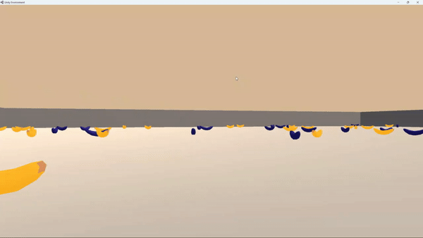

# Training Banana Collector using DQN

## 1. Introduction
In this project, we'll train an agent using Deep Q-learning to collect as many yellow bananas 
as possible in a large square environment.

* __Reward and Punishment__: +1 reward for collecting yellow bananas, and -1 for blue bananas.
* __Goal__: Collect as many yellow bananas as possible and avoid blue bananas. This is an episodic
task and the gaol is to collect an average of +13 rewards in 100 consecutive tasks.
* __State Space__: The state space in this study has 37 dimensions, and contains agent's velocity
and ray-based perception of objects in front of the agent.
* __Action Space__: We have four possible actions anytime:
  * 0: Forward
  * 1: Backward 
  * 2: Left
  * 3: Right

## 2. Installation on Windows

## 3. Training the Agent

## 4. Visualizing the Agent
To Visualize the agent, you can use ``

### Acknowledgement
This project is a part of
[Deep Reinforcement Learning Nanodegree](https://www.udacity.com/course/deep-reinforcement-learning-nanodegree--nd893) program.
