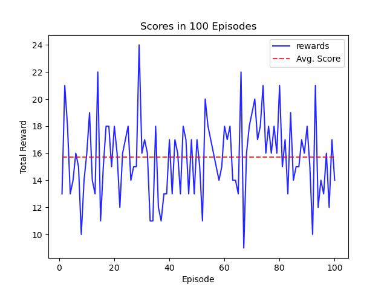

# Report

## 1. Introduction
In this project I trained an agent using Deep Q-learning (DQN) to collect an average of +13 
yellow bananas in 100 consecutive episodes. The DQN algorithm used here, applies experience replay to remove 
correlation between consecutive tuple experiences, and help the algorithm remember rare events.
I also used fixed target in this algorithm to help it converge.

## 2. Q-network
The model used to estimate the q-values for different actions is a multi-layer perceptron with 
two hidden layers, each with 64 nodes and Relu activation functions. The output layer has 4 
nodes (each corresponding to one of the actions 1 to 4), and an identity activation function.
To optimize the weights, I used Adam optimizer with a learning rate of 0.0005.


## 3. Hyperparameters

| **Parameter**           | **Value** |
|:------------------------|:---------:|
| Gamma                   |   0.99    |
| $\epsilon_{initial}$    |    1.0    |
| $\epsilon_{min}$        |   0.01    |
| epsilon_decay           |   0.995   |
| update_target_frequency |     4     |
| update_main_frequency   |     4     |
| epsilon_decay           |   0.995   |
| buffer_size             |  100,000  |
| batch_size              |    64     |
| buffer_size             |  100,000  |
| target_score            |   15.0    |


### 4. Training the agent
The agent exceeded the target score (15.0) in 687 episodes! Here is the scores collected
in each episode during the training phase:


### 5. Test for 100 Episodes
The trained agent is evaluated on 100 episodes and the output is shown
in the figure below:



The same experiment can be done using:
```
python TestAgent.py
```


